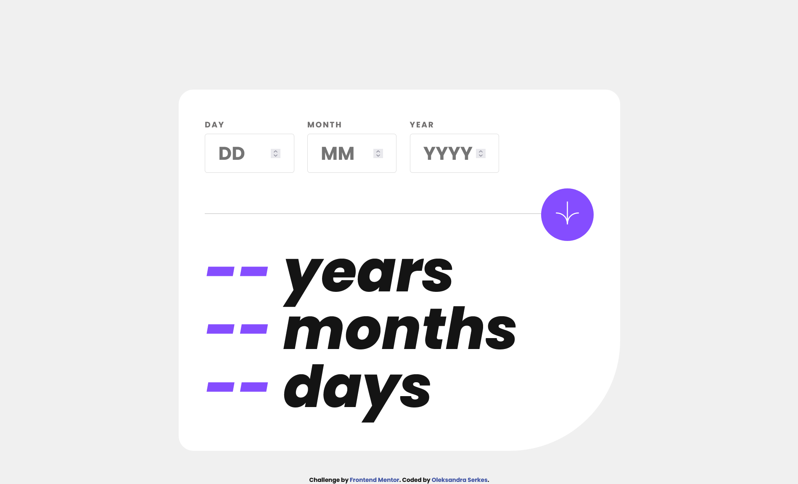
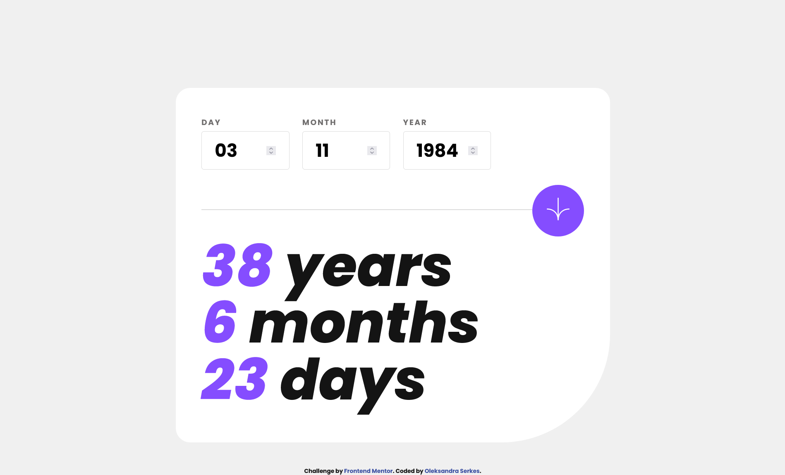
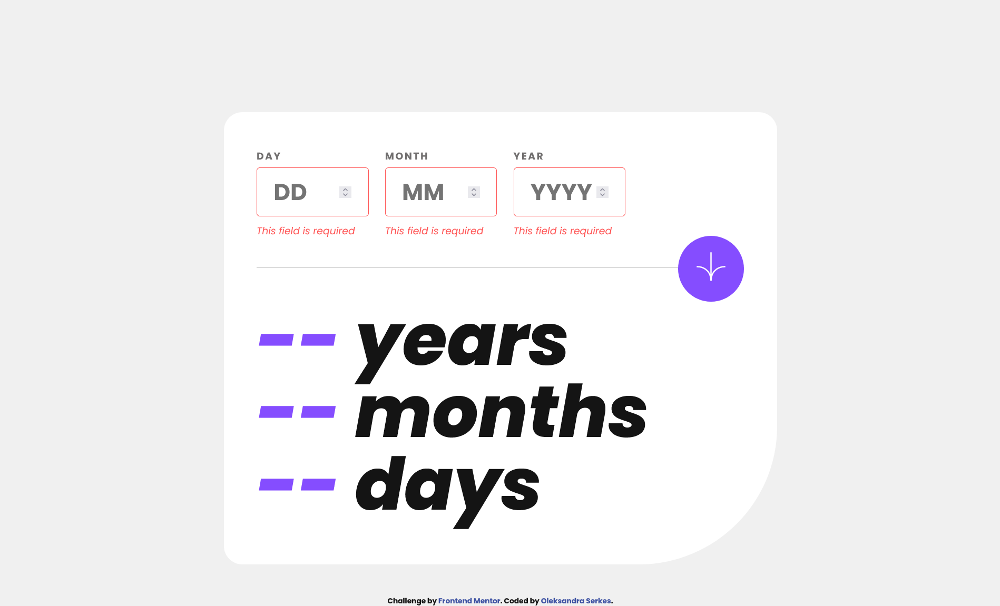

# Frontend Mentor - Age calculator app solution

This is a solution to the [Age calculator app challenge on Frontend Mentor](https://www.frontendmentor.io/challenges/age-calculator-app-dF9DFFpj-Q). Frontend Mentor challenges help you improve your coding skills by building realistic projects.

## Table of contents

- [Overview](#overview)
  - [The challenge](#the-challenge)
  - [Screenshot](#screenshot)
  - [Links](#links)
- [My process](#my-process)
  - [Built with](#built-with)
  - [What I learned](#what-i-learned)
  - [Continued development](#continued-development)
  - [Useful resources](#useful-resources)
- [Author](#author)
- [Acknowledgments](#acknowledgments)

## Overview

### The challenge

Users should be able to:

- View an age in years, months, and days after submitting a valid date through the form
- Receive validation errors if:
  - Any field is empty when the form is submitted
  - The day number is not between 1-31
  - The month number is not between 1-12
  - The year is in the future
  - The date is invalid e.g. 31/04/1991 (there are 30 days in April)
- View the optimal layout for the interface depending on their device's screen size
- See hover and focus states for all interactive elements on the page

### Screenshot

### Links

- Solution URL: [GitHub Pages](https://github.com/OlSerkes/age-calculator-app-main)
- Live Site URL: [Live site URL](https://olserkes.github.io/age-calculator-app-main/)

## My process

### Built with

- Semantic HTML5 markup
- SCSS custom properties
- Flexbox
- JavaScript
- Mobile-first workflow

### What I learned

I learned about the built-in object: Date, how to create a new Date object, call new Date(). Learned about methods to access the year, month, etc. from the Date object. And created several functions to prevent user errors.

### Continued development

I want to continue focusing on learning using built-in object Date and it's methods and using it in my future projects. I want to refine and perfect it.

### Useful resources

- [JavaScript.info](https://javascript.info/date) - This helped me object Date. I really liked this site and will use it going forward.
- [developer.mozilla.org](https://developer.mozilla.org/en-US/docs/Web/JavaScript/Reference/Global_Objects/Date/Date) - Documentation which helped me finally understand Date(). I'd recommend it to anyone still learning this concept.

## Author

- Website - [Oleksandra Serkes](https://github.com/OlSerkes)
- Frontend Mentor - [@OlSerkes](https://www.frontendmentor.io/profile/OlSerkes)
- Linkedin - [Oleksandra Serkes](https://www.linkedin.com/in/oleksandra-serkes-65580620a/)
